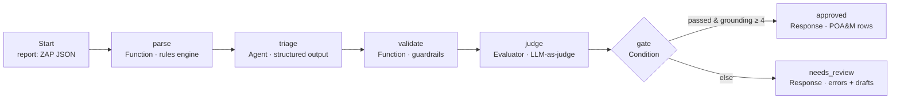

# ZAP → FedRAMP POA&M Triage Agent (built on Sim)

An agent workflow that turns a raw OWASP ZAP scan report into **POA&M-ready findings** for a FedRAMP reviewer. For each finding it assigns a deterministic risk rating and remediation deadline, maps it to a NIST 800-53 control, quotes the evidence verbatim, flags likely false positives, gives concrete remediation steps, and writes a ticket summary. The output is validated before anything leaves the workflow.

## Why I built this

At Citrix (Cloud Software Group) I built an internal tool that processed OWASP ZAP scan reports into evidence tickets for the US government's Joint Authorization Board. It took a **5-day manual FedRAMP task down to 30 minutes.** This repo is a **clean-room re-implementation of that idea** on [Sim](https://sim.ai), using **synthetic scan data only**. It contains no Citrix code or data. I rebuilt it as an agent workflow with a real evaluation loop, which is how I would ship it to a customer today.

## Architecture



### Design choices

| Decision | Why |
|---|---|
| **Rules first, LLM second.** Risk and due dates are computed in code (ZAP riskcode → FedRAMP High 30 / Moderate 90 / Low 180 days). | Compliance deadlines must be exact and auditable. The model is never allowed to set them. |
| **The LLM only does judgment work:** control mapping, false-positive reasoning, remediation, and ticket prose. | That is where language models add value, and scanner noise is what makes manual triage slow. |
| **Structured output + an allow-list of controls** | The downstream POA&M needs fixed fields. The model can't drift into free text or invented control families. |
| **A code validator re-checks every prompt rule:** coverage, unchanged risk, allow-listed control, verbatim evidence. | Prompts are requests, not guarantees. The verbatim-evidence check catches hallucinated evidence. |
| **An LLM judge scores grounding, actionability, and auditor-readiness** | This catches quality problems that code can't express. |
| **Failures route to human review instead of erroring out** | A finding bound for a government reviewer should never ship unchecked. |

## Build it in Sim (≈60–90 min)

1. Sign in at sim.ai and create a new workflow named `zap-fedramp-triage`.
2. **Start trigger:** add an input field named `report` of type object (or JSON).
3. **Function block → rename to `parse`:** paste [`sim_blocks/01_parse.js`](sim_blocks/01_parse.js).
4. **Agent block → rename to `triage`:** paste the system prompt, user prompt, and response format from [`sim_blocks/02_triage_agent.md`](sim_blocks/02_triage_agent.md). Set temperature to 0–0.2.
5. **Function block → rename to `validate`:** paste [`sim_blocks/03_validate.js`](sim_blocks/03_validate.js).
6. **Evaluator, Condition, and two Response blocks:** configure them from [`sim_blocks/04_judge_gate_response.md`](sim_blocks/04_judge_gate_response.md).
7. Wire the blocks as in the diagram. Run in the editor with the contents of [`sample_data/zap_report_demo.json`](sample_data/zap_report_demo.json) as `report`.
8. **Deploy → API.** Copy the workflow ID and create a key under Settings → Sim Keys.
9. Run the evals (below) and paste the results table into this README.
10. (Optional) Add a Slack or Jira block and a Human-in-the-Loop approval on the `approved` path.

> Block names matter. Tags like `<parse.result>` refer to blocks by name. If you rename a block, use the tag picker to update its references.

## Evals

`evals/golden_labels.json` holds hand-labeled expectations for two synthetic scans (11 alerts). They include **two deliberate false positives**:

- A "High" SQL injection flagged on a static CSS file, where the only signal is a 3-byte response difference.
- A missing-CSRF-token alert on a GET-only, read-only search form.

```bash
pip install requests
export SIM_API_KEY=...  SIM_WORKFLOW_ID=...
python evals/run_evals.py --runs 3     # live, 3 runs per case to measure variance
```

| Metric | What it checks |
|---|---|
| validator_passed | The run cleared every guardrail |
| coverage | Every non-informational alert produced a POA&M row |
| risk_preserved / deadline_correct | The rules-engine values survived end to end |
| control_acceptable | The NIST control is one a human labeled acceptable |
| fp_recall | The labeled false positives were flagged "high" FP likelihood |
| tp_not_dismissed | Real findings were **not** waved away as false positives, which is the costlier error |

**Results:** *(fill in after running against your deployed workflow — model, date, mean of 3 runs)*

### Verified locally without an LLM

`local_test/run_blocks_locally.js` runs the exact Function-block code outside Sim. It feeds the validator two mock agent outputs:

```bash
node local_test/run_blocks_locally.js sample_data/zap_report_demo.json local_test/mock_triage_good.json
node local_test/run_blocks_locally.js sample_data/zap_report_demo.json local_test/mock_triage_bad.json
```

The "bad" output has four injected failures: a hallucinated evidence quote, a downgraded risk, an out-of-list control (SA-11), and a dropped alert. **The validator catches all four** and routes the run to human review.

## Limits and next steps

- ZAP riskcode is the **initial** risk rating. A real ISSO still confirms or adjusts it before POA&M submission.
- The control mapping is a suggestion for reviewer confirmation, not an assessment.
- Next steps: dedupe findings against the previous month's POA&M (a Sim Table), open Jira tickets per row, and schedule the workflow to run after each monthly scan.


#Output screenshots in the root
